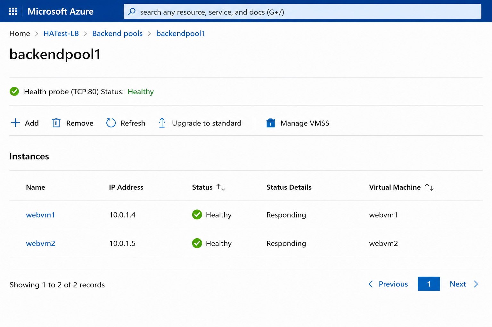

# Outputs
- Load Balancer Public IP: Accessible via browser.  
- Health Probe: Shows VM alternation.  
- Screenshots: LB backend pool, VM status.  

## Screenshot

Embedded screenshot in outputs.md

