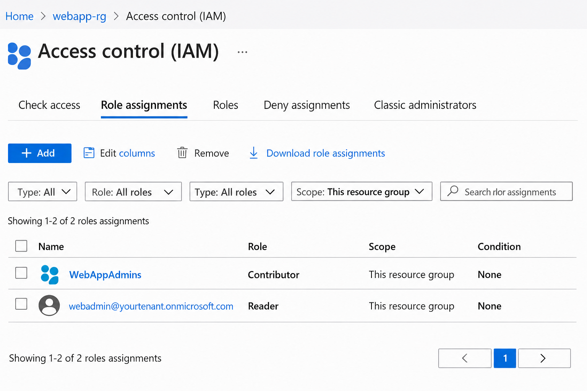

# Outputs
- Contributor role applied to group.
- Reader role applied to user.
- Policy enforcement visible in portal.
- Resource group lock prevents deletion.

## Screenshot

Embedded screenshot in outputs.md

